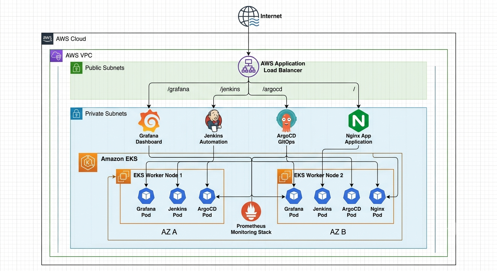
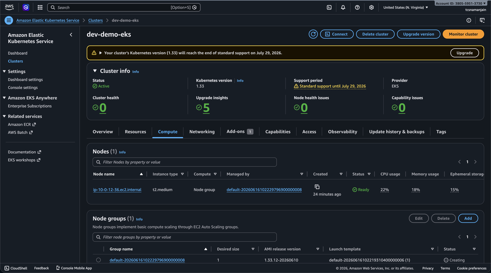
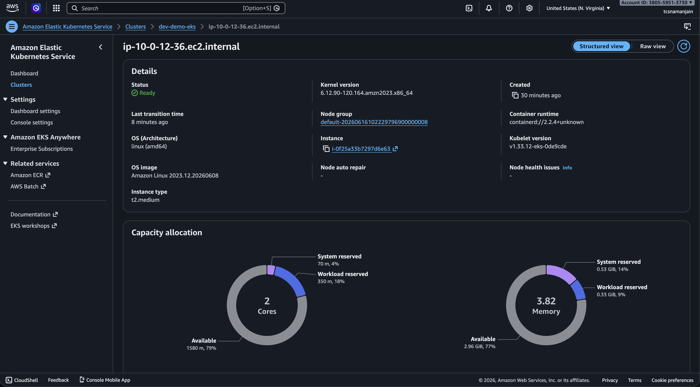
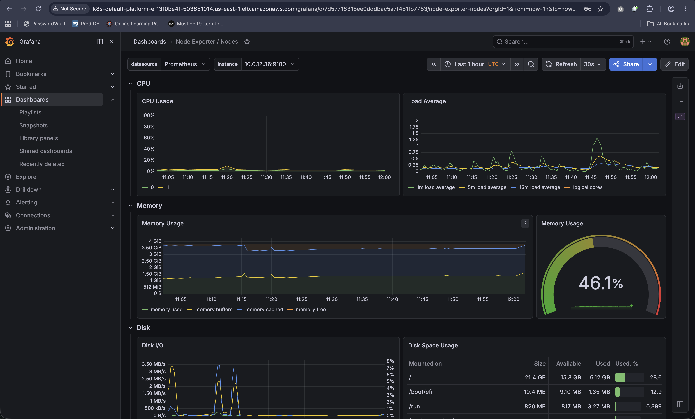

<<<<<<< HEAD

# AWS EKS Platform with Terraform

A production-style Kubernetes platform deployed on AWS using Terraform.

## Features

- Infrastructure as Code using Terraform
- Amazon EKS Cluster
- Managed Node Groups
- VPC with Public and Private Subnets
- IAM Roles and Policies
- AWS Load Balancer Controller
- NGINX Application Deployment
- Prometheus Monitoring
- Grafana Dashboards
- ALB Based Routing

## Architecture

## Technology Stack

| Category | Tools |
|-----------|--------|
| Cloud | AWS |
| IaC | Terraform |
| Container Orchestration | Kubernetes |
| Monitoring | Prometheus |
| Visualization | Grafana |
| Ingress | AWS Load Balancer Controller |
| Web Server | NGINX |

## Deployment Workflow

Terraform → AWS Infrastructure → EKS → Monitoring Stack → Applications → ALB Routing

## Screenshots

### EKS Cluster

### Worker Nodes

### Grafana Dashboard

## Documentation

- [Architecture](docs/architecture.md)
- [Deployment Guide](docs/deployment-guide.md)
- [Monitoring Setup](docs/monitoring.md)
- [Troubleshooting](docs/troubleshooting.md)

## Author

Naman Jain
=======
# aws-eks-observability-platform
Production-ready AWS EKS platform built using Terraform with Prometheus, Grafana, AWS Load Balancer Controller and Ingress-based application routing.
>>>>>>> c5f2fe669de0bd9523dd0dc8e7f276d1563ff7da
